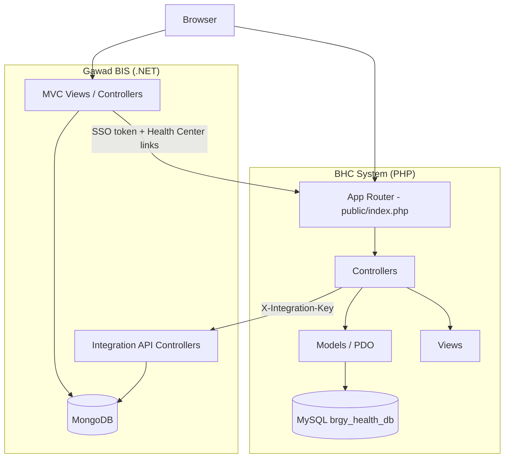
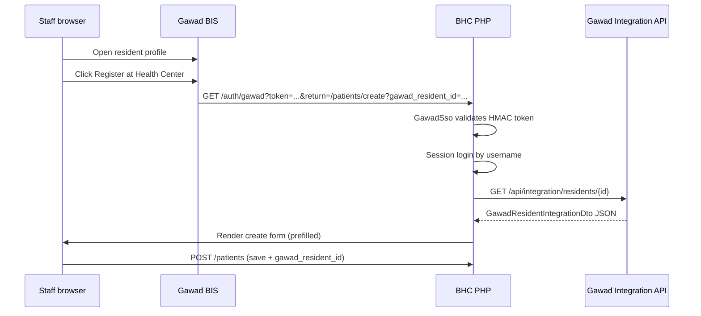

# Integrated Barangay System — Source Code & Documentation

**Gawad BIS** (ASP.NET Core 8) + **BHC System** (PHP / MySQL)  
Barangay Balong Bato, San Juan City

> **Audience:** Developers, IT implementers, thesis reviewers, and maintainers.

---

## Table of contents

1. [System overview](#1-system-overview)
2. [Technology stack](#2-technology-stack)
3. [Architecture](#3-architecture)
4. [BHC source code structure](#4-bhc-source-code-structure)
5. [Gawad BIS source code structure](#5-gawad-bis-source-code-structure)
6. [Integration design](#6-integration-design)
7. [API reference](#7-api-reference)
8. [Single sign-on (SSO)](#8-single-sign-on-sso)
9. [Database schemas](#9-database-schemas)
10. [Configuration](#10-configuration)
11. [Local development setup](#11-local-development-setup)
12. [Deployment](#12-deployment)
13. [Utility scripts](#13-utility-scripts)
14. [Security notes](#14-security-notes)
15. [Related documents](#15-related-documents)

---

## 1. System overview

The integrated platform separates **barangay-wide records** from **clinical operations** while linking them where it matters:

| Concern | System | Database |
|---------|--------|----------|
| Resident master data, permits, barangay medicine inventory | Gawad BIS | MongoDB (`gawad_db`) |
| Patient registry, queues, triage, consultation, dispensing, clinical documents | BHC | MySQL (`brgy_health_db`) |

**Integration goals:**

- One-time resident enrollment in Gawad → prefill BHC patient registration
- Shared staff identity (username) with optional SSO
- Read-only medicine catalog + stock from Gawad for BHC prescription picker
- Audit trail on both sides for accountability

**Repository layout (typical):**

```
bhc_system/                    ← BHC PHP app (this repository)
barangay-integrated-system/
  gawad-bis/                   ← junction or copy of Gawad project
project-gawad-main/            ← Gawad BIS .NET solution (Project.Gawad.sln)
```

BHC lives at `c:\PUP\htdocs\bhc_system`. Gawad BIS is a separate .NET solution, often referenced via a workspace junction.

---

## 2. Technology stack

### BHC System

| Layer | Technology |
|-------|------------|
| Language | PHP 8.1+ |
| Architecture | Custom MVC (no framework) |
| Database | MySQL 8 / MariaDB (`utf8mb4`) |
| Web server | Apache (XAMPP) or InfinityFree |
| Session | PHP `$_SESSION` via `core/Auth.php` |
| Front end | Server-rendered PHP views, vanilla JavaScript |

### Gawad BIS

| Layer | Technology |
|-------|------------|
| Framework | ASP.NET Core 8 MVC (`net8.0`) |
| Database | MongoDB |
| Auth | ASP.NET Identity (cookies) |
| UI | AdminLTE, Bootstrap Icons |
| Dev URL | `http://localhost:5003` |

---

## 3. Architecture

### High-level diagram



### Request flow (BHC)

1. Apache routes requests to `public/index.php` (`.htaccess` rewrite).
2. `core/App.php` matches method + path against registered routes.
3. Controller method runs (`requireAuth`, `requireRole`, business logic).
4. Model layer uses PDO (`config/database.php`).
5. View rendered via `Controller::view()`.

### Design principles

- **BHC** owns clinical workflow and queue state.
- **Gawad** owns resident master data and medicine inventory.
- Integration is **HTTP + shared secrets**, not a shared database.
- BHC `ensureSchema()` in `config/database.php` migrates schema on connect (additive only).

---

## 4. BHC source code structure

```
bhc_system/
├── public/
│   ├── index.php          # Entry point + route table
│   ├── .htaccess          # URL rewriting
│   └── assets/            # CSS, JS, images, workflow diagrams
├── config/
│   ├── app.php            # Loads app.local.php or app.infinityfree.php
│   ├── app.local.php      # base_path, base_url (XAMPP)
│   ├── database.php       # PDO + ensureSchema()
│   └── gawad_integration.php + gawad_integration.local.php
├── core/
│   ├── App.php            # Router
│   ├── Controller.php     # Base controller, auth guards, redirects
│   ├── Auth.php           # Session login state
│   ├── helpers.php        # app_url(), app_route(), h()
│   ├── GawadIntegration.php
│   ├── GawadSso.php
│   ├── GawadStaffSync.php
│   ├── ReportMonth.php
│   └── ReportPeriod.php
├── controllers/           # 14 controllers (see table below)
├── models/                # PDO data access
├── views/                 # PHP templates + layout partials
├── scripts/               # CLI utilities
├── docs/                  # This documentation package
├── deploy/infinityfree/   # Production build output
└── database_schema.sql    # Canonical MySQL schema
```

### Controllers

| Controller | Responsibility |
|------------|----------------|
| `HomeController` | Dashboards: `/`, `/staff`, `/admin` |
| `AuthController` | Login, logout, `GET /auth/gawad` (SSO) |
| `PatientController` | CRUD, search, Gawad import, link-gawad, archive |
| `QueueController` | Stations, queues, tickets, display, triage enqueue |
| `CoordinatorController` | Multi-station board `/coordinator` |
| `ClinicalController` | Triage/consultation/dispense at desk, documents, receipts |
| `DoctorController` | Doctor portal `/doctor`, patient charts, documents |
| `AppointmentController` | Clinic appointments |
| `MedicineCatalogController` | Local medicine name list (admin) |
| `ReportController` | Daily, monthly, clinical, appointments + CSV |
| `AuditController` | Activity log |
| `UserController` | Staff accounts, Gawad sync |
| `AccountController` | Password, document name (doctors) |

### Key models

| Model | Table(s) |
|-------|----------|
| `Patient` | `patients` — search, validate, Gawad link |
| `QueueTicket` | `queue_tickets` — daily per-station queue |
| `PatientVisit` | `patient_visits` — one visit episode per day |
| `TriageRecord` | `triage_records` |
| `ConsultationRecord` | `consultation_records` |
| `MedicineDispensing` | `medicine_dispensings` |
| `MedicineCatalog` | `medicine_catalog` + Gawad picker overlay |
| `ClinicalDocument` | `clinical_documents` |
| `User` | `users` |
| `AuditLog` | `audit_logs` |

### Route registration

All routes are defined in `public/index.php` (lines 68–175). Examples:

| Method | Path | Handler |
|--------|------|---------|
| GET | `/patients/create` | `PatientController::create` |
| GET | `/patients/search` | `PatientController::search` (JSON) |
| GET | `/auth/gawad` | `AuthController::gawadSso` |
| POST | `/users/sync-gawad` | `UserController::syncFromGawad` |
| GET | `/doctor/queue-snapshot` | `DoctorController::queueSnapshot` (JSON poll) |
| POST | `/queue/{id}/triage/{ticketId}` | `QueueController::storeTriage` |
| POST | `/queue/{id}/consultation/{ticketId}` | `ClinicalController::storeConsultation` |
| POST | `/queue/{id}/dispense/{ticketId}` | `ClinicalController::storeDispensing` |

### URL helpers

`core/helpers.php` provides subfolder-safe URLs:

- `app_url('/patients')` → `http://localhost/bhc_system/public/patients`
- `app_route('/patients')` → path for form actions
- `app_base_path()` → `/bhc_system/public`

`Controller::redirect()` prefixes `app_base_path()` automatically.

---

## 5. Gawad BIS source code structure

```
project-gawad-main/
├── Project.Gawad.sln
└── src/
    ├── Project.Gawad.Client/           # MVC entry, Views, Integration controllers
    ├── Project.Gawad.Application/      # Services, BhcSsoLinkService, providers
    ├── Project.Gawad.Core/             # Interfaces
    ├── Project.Gawad.Domain/           # Entities, DTOs, enums
    ├── Project.Gawad.Infrastructure/
    └── Project.Gawad.Data.MongoDb/     # Repositories
```

### Key Gawad files (integration)

| File | Purpose |
|------|---------|
| `Application/Options/BhcIntegrationOption.cs` | Config model |
| `Client/appsettings.json` | `BhcIntegration` section |
| `Client/Controllers/IntegrationResidentsController.cs` | Resident export API |
| `Client/Controllers/IntegrationMedicinesController.cs` | Medicine export API |
| `Client/Controllers/IntegrationUsersController.cs` | Staff export API |
| `Application/Services/BhcSsoLinkService.cs` | SSO token + BHC deep links |
| `Views/Residents/Profile.cshtml` | **Register at Health Center** button |
| `Views/Shared/PartialViews/_SideBarPartialView.cshtml` | Health Center sidebar links |

### Gawad roles (`RoleType`)

| Enum | Display name |
|------|--------------|
| `Administrator` | Administrator |
| `BarangaySecretary` | Barangay Secretary |
| `Kagawad` | Kagawad |
| `Staff` | Health Worker / Staff |

---

## 6. Integration design

### Phase map

| Phase | Feature | Direction |
|-------|---------|-----------|
| 1 | Deep links to BHC | Gawad → BHC (URLs) |
| 2 | Resident prefill | Gawad API → BHC `PatientController::create` |
| 3 | SSO | Gawad token → BHC `AuthController::gawadSso` |
| 4 | Medicine catalog sync | Gawad API → BHC `MedicineCatalog::pickerMeta` |
| — | Staff user sync | Gawad API → BHC `GawadStaffSync` |

### Resident registration sequence



### Medicine sync behavior

- **Source of truth:** Gawad `Medicines` collection / stock batches.
- **BHC consumption:** `GawadIntegration::fetchMedicines()` → `MedicineCatalog::pickerList()`.
- **Fallback:** Local `medicine_catalog` table if API fails or sync disabled.
- **Dispense:** Recorded in BHC `medicine_dispensings`; does **not** POST back to reduce Gawad stock (by design — manual stock update in Gawad).

### Staff sync behavior

- `GawadStaffSync::sync()` pulls `GET /api/integration/users`.
- Creates BHC users that do not exist (matched by `username`).
- Maps Gawad `Administrator` → BHC `admin`; others → `staff`.
- Does not create `doctor` roles or deactivate removed Gawad users automatically.

---

## 7. API reference

### Authentication

All Gawad integration endpoints require:

```http
X-Integration-Key: {shared secret}
```

Must match `BhcIntegration:IntegrationApiKey` (Gawad) and `integration_api_key` (BHC).

### Gawad → BHC (outbound from Gawad)

SSO login URL pattern:

```
{BhcBaseUrl}/auth/gawad?token={signed}&return={urlencoded path}
```

Example return path: `/patients/create?gawad_resident_id=507f1f77bcf86cd799439011`

### BHC → Gawad (inbound API calls)

Base URL: `{api_base_url}` (default `http://localhost:5003`)

#### GET `/api/integration/residents/{id}`

- **Gate:** `ResidentSyncEnabled`
- **ID format:** 24-char hex MongoDB ObjectId
- **Response fields:** `Id`, `FirstName`, `MiddleName`, `LastName`, `Suffix`, `Sex`, `Birthdate`, `Address`, `Barangay`, `CivilStatus`, `IsBarangayResident`, etc.
- **BHC consumer:** `core/GawadIntegration.php::fetchResident()`

#### GET `/api/integration/medicines`

- **Gate:** `Enabled` + `MedicineSyncEnabled`
- **Response:** Array of `{ Id, Name, UnitOfMeasure, CurrentStock, MinimumStockLevel, IsLowStock, IsOutOfStock }`
- **BHC consumer:** `GawadIntegration::fetchMedicines()` → `MedicineCatalog::pickerMeta()`

#### GET `/api/integration/users`

- **Gate:** `Enabled`
- **Response:** Array of `{ UserName, FullName, GawadRole, GawadRoleType }`
- **BHC consumer:** `GawadIntegration::fetchStaffUsers()` → `GawadStaffSync`

### BHC JSON endpoints (internal)

| Endpoint | Auth | Purpose |
|----------|------|---------|
| `GET /patients/search?q=&birthdate=&contact=` | Logged in | Duplicate patient autocomplete |
| `GET /doctor/queue-snapshot` | Doctor | Queue poll for auto-refresh |
| `GET /patients/{id}/appointment-today` | Logged in | Registration desk banner |
| `GET /patients/{id}/queue-status` | Logged in | Active ticket check |

---

## 8. Single sign-on (SSO)

### Token format

```
{base64url(payload)}.{base64url(hmac_sha256(payload, sso_secret))}
```

Payload JSON:

```json
{
  "u": "username",
  "exp": 1717200000,
  "n": "random-nonce",
  "r": "optional-role-hint"
}
```

### Gawad issuer

`BhcSsoLinkService` (Gawad) builds tokens when `SsoEnabled` and `SsoSecret` are set.

### BHC validator

`core/GawadSso.php`:

1. Split token, verify HMAC with `sso_secret`.
2. Check `exp` against `sso_token_lifetime_seconds`.
3. Load BHC user by `u` (username).
4. `Auth::login()` and redirect to `return` path.

### Failure modes

| Condition | Result |
|-----------|--------|
| Invalid/expired token | Login form with error |
| Username not in BHC | Login form — run staff sync |
| SSO disabled | Manual BHC login only |

---

## 9. Database schemas

### BHC (MySQL) — `database_schema.sql`

Core tables:

| Table | Purpose |
|-------|---------|
| `patients` | Registry; `bhc_id`, `gawad_resident_id`, `registration_source`, residency fields, `archived_at` |
| `stations` | RG, TR, CN, PH (seeded) |
| `queue_tickets` | `status`: waiting \| serving \| done \| skipped |
| `patient_visits` | Daily visit episodes |
| `triage_records` | Vitals per visit |
| `consultation_records` | Diagnosis, `doctor_id` |
| `medicine_dispensings` | Line items per consultation |
| `medicine_catalog` | Local fallback names |
| `clinical_documents` | Receipts, certificates, referrals |
| `patient_appointments` | Follow-up scheduling |
| `users` | `role`: admin \| staff \| doctor |
| `audit_logs` | Structured activity trail |

Runtime migrations in `config/database.php::ensureSchema()` add columns such as `gawad_resident_id`, `document_display_name`, `assigned_doctor_id`, etc., without dropping data.

### Gawad (MongoDB)

Collections include (representative):

- Residents / persons
- Medicines, stock batches, transactions
- ASP.NET Identity users and roles
- Barangay operational modules (clearances, permits, etc.)

Gawad does not store BHC queue or clinical data.

---

## 10. Configuration

### BHC — `config/gawad_integration.php`

| Key | Description |
|-----|-------------|
| `enabled` | Master switch for API calls |
| `api_base_url` | Gawad base URL |
| `integration_api_key` | Must match Gawad |
| `sso_enabled` | Accept `/auth/gawad` tokens |
| `sso_secret` | HMAC shared secret |
| `sso_token_lifetime_seconds` | Token TTL (default 300) |
| `medicine_sync_enabled` | Use Gawad medicines in picker |

Local overrides: copy `gawad_integration.local.example.php` → `gawad_integration.local.php`.

### BHC — `config/app.local.php`

```php
'base_path' => '/bhc_system/public',
'base_url'  => 'http://localhost/bhc_system/public',
```

For patient QR on phones, use the server **LAN IP** instead of `localhost`.

### BHC — `config/database.php`

```php
'host' => 'localhost',
'dbname' => 'brgy_health_db',
'user' => 'root',
'password' => '',
```

### Gawad — `appsettings.json` → `BhcIntegration`

```json
{
  "Enabled": true,
  "BaseUrl": "http://localhost/bhc_system/public",
  "OpenInNewTab": true,
  "ResidentSyncEnabled": true,
  "MedicineSyncEnabled": true,
  "IntegrationApiKey": "balong-bato-dev-integration-key",
  "SsoEnabled": true,
  "SsoSecret": "balong-bato-dev-sso-secret",
  "SsoTokenLifetimeSeconds": 300
}
```

**Both systems must use matching keys and secrets.**

---

## 11. Local development setup

### Prerequisites

- XAMPP (Apache + MySQL + PHP 8.1+)
- .NET 8 SDK
- MongoDB (local or Docker)
- Git

### BHC

1. Place project in `htdocs/bhc_system/`.
2. Create MySQL database `brgy_health_db` (optional: import `database_schema.sql`).
3. Configure `config/app.local.php` and `config/database.php`.
4. Copy `config/gawad_integration.local.example.php` → `config/gawad_integration.local.php`.
5. Open `http://localhost/bhc_system/public/login`.
6. Default admin: `admin` / `admin123` (auto-seeded if no users).

### Gawad BIS

1. Open `Project.Gawad.sln` in Visual Studio or VS Code.
2. Set `Project.Gawad.Client` as startup project.
3. Configure MongoDB connection string in `appsettings.json` / `appsettings.Development.json`.
4. Set `BhcIntegration` section (see above).
5. Run: `dotnet run --project src/Project.Gawad.Client` (or F5).
6. Browse `http://localhost:5003`.

### Verify integration

```bash
# Medicines API (replace key)
curl -H "X-Integration-Key: balong-bato-dev-integration-key" http://localhost:5003/api/integration/medicines

# BHC patient search (requires session cookie after login)
curl "http://localhost/bhc_system/public/patients/search?q=Juan"
```

### Staff sync (CLI)

```bash
cd c:\PUP\htdocs\bhc_system
php scripts/sync_gawad_staff_users.php --password=TempPass123 --dry-run
php scripts/sync_gawad_staff_users.php --password=TempPass123
```

---

## 12. Deployment

### BHC on InfinityFree

See [DEPLOY_INFINITYFREE.md](DEPLOY_INFINITYFREE.md):

1. Configure `config/database.infinityfree.php`.
2. Run `php scripts/build-infinityfree-deploy.php`.
3. Upload `deploy/infinityfree/package/` contents to `htdocs/`.
4. Production URL example: `https://bhcs.free.nf`.

Update Gawad `BhcIntegration:BaseUrl` to the production BHC URL if linking from a hosted Gawad instance.

### LAN deployment (recommended for clinic)

- BHC on a fixed-LAN-IP XAMPP PC
- Gawad on same network or same server
- Waiting-area TVs use `/display/{stationId}` with LAN `base_url`

### Rebuild deploy package

After code changes, always re-run the build script — the packaged copy may lag behind development.

---

## 13. Utility scripts

| Script | Purpose |
|--------|---------|
| `scripts/create_staff_user.php` | CLI user creation |
| `scripts/sync_gawad_staff_users.php` | Pull Gawad users into BHC |
| `scripts/build-infinityfree-deploy.php` | Production package build |
| `scripts/seed_*.php` | Development data (if present) |

---

## 14. Security notes

| Topic | Current behavior | Production recommendation |
|-------|------------------|---------------------------|
| Integration API key | Shared static key in config | Rotate keys; use env vars, not committed secrets |
| SSO secret | Shared HMAC secret | Strong random secret; HTTPS only |
| Gawad API | `[AllowAnonymous]` + API key header | Restrict by IP or mTLS in production |
| Default admin | `admin`/`admin123` on empty DB | Change immediately; deactivate default |
| Patient display | Public, no auth | Ticket numbers only; hide names on public TVs |
| SQL injection | PDO prepared statements | Keep pattern for new queries |
| CSRF | Forms use POST; no global CSRF token yet | Consider tokens for sensitive actions |

Config directory is blocked by `config/.htaccess` on Apache.

---

## 15. Related documents

| Document | File |
|----------|------|
| Documentation index | [README.md](README.md) |
| Integrated user guide | [INTEGRATED_USER_GUIDE.md](INTEGRATED_USER_GUIDE.md) |
| BHC user guide | [USER_GUIDE.md](USER_GUIDE.md) |
| Workflow summary | [WORKFLOW_SUMMARY.md](WORKFLOW_SUMMARY.md) |
| Workflow diagrams | [WORKFLOW_DIAGRAM.md](WORKFLOW_DIAGRAM.md), [workflow-diagram.mmd](workflow-diagram.mmd), [ticket-lifecycle.mmd](ticket-lifecycle.mmd) |
| InfinityFree deploy | [DEPLOY_INFINITYFREE.md](DEPLOY_INFINITYFREE.md) |
| MySQL schema | `database_schema.sql` (project root — not in this folder) |

---

## Appendix A — Default station IDs

| ID | Code | Name |
|----|------|------|
| 1 | RG | Registration |
| 2 | TR | Triage / Vitals |
| 3 | CN | Consultation |
| 4 | PH | Pharmacy |

## Appendix B — BHC audit action types (sample)

`login`, `logout`, `login_failed`, `patient_create`, `patient_update`, `ticket_create`, `ticket_call`, `ticket_call_next`, `ticket_call_next_auto`, `ticket_complete`, `ticket_skip`, `ticket_recall`, `user_create`, `user_deactivate`, `user_activate`, `user_password_reset`, `gawad_staff_sync`, `gawad_link`

## Appendix C — Patient registration sources

| `registration_source` | Meaning |
|-----------------------|---------|
| `gawad_bis` | Created via Gawad import link |
| `emergency_walk_in` | Staff emergency path with documented reason |
| `admin_direct` | Admin manual registration |

---

*Source Code & Documentation — Integrated Gawad BIS + BHC System. June 2026.*
