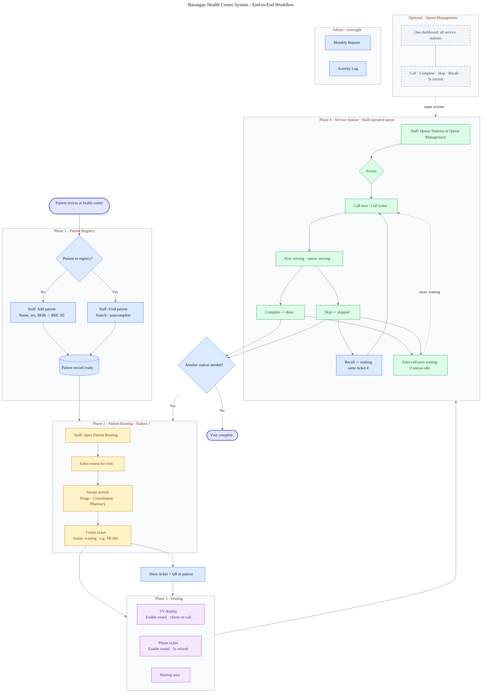
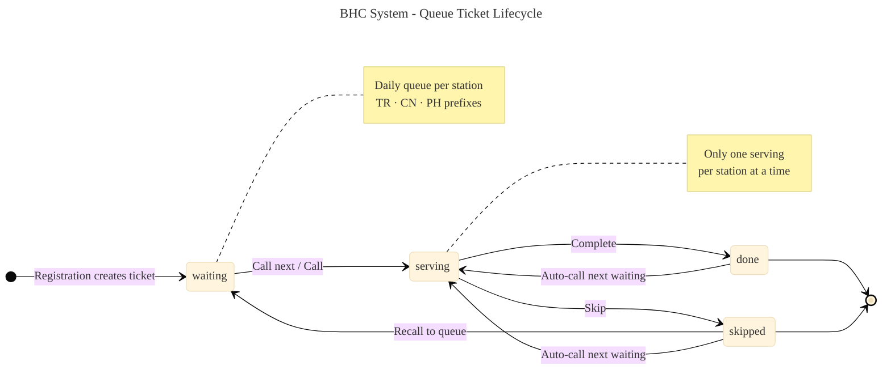
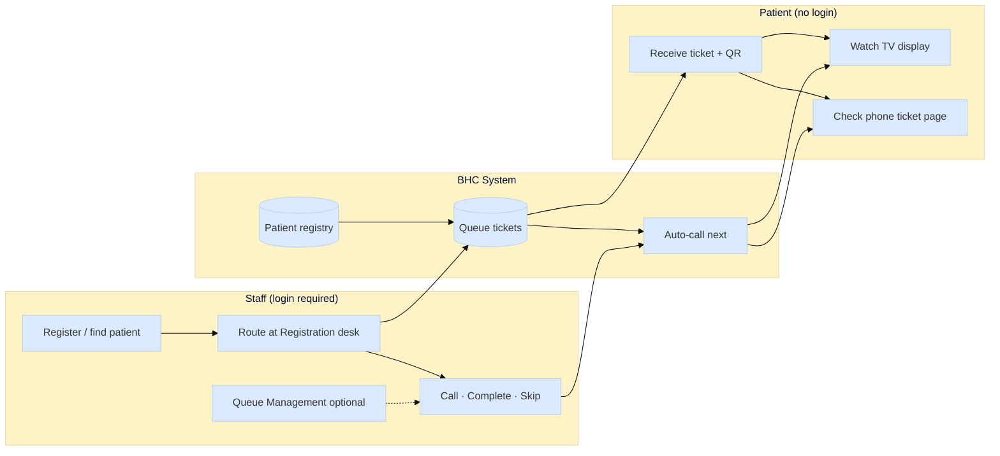

# BHC System - Mermaid Workflow Diagrams

Use these diagrams in **[Mermaid Live Editor](https://mermaid.live)** for a clean, interactive view and to **export PNG or SVG** (higher quality than a hand-drawn image).

---

## **How to generate a diagram (recommended)**

1. Open **[https://mermaid.live](https://mermaid.live)**
2. Copy the contents of one of the source files:
   - **Full visit workflow:** [`workflow-diagram.mmd`](workflow-diagram.mmd)
   - **Ticket statuses only:** [`ticket-lifecycle.mmd`](ticket-lifecycle.mmd)
3. Paste into the editor (left panel). The preview updates on the right.
4. Use **Actions -> PNG** or **SVG** to download.
5. Optional: **Actions -> Copy PNG** for slides or documents.

**In VS Code / Cursor:** Install the *Mermaid* extension, open a `.mmd` file, then use **Preview** or export from the preview.

**On GitHub:** Paste a ` ```mermaid ` block (see below) in any `.md` file; GitHub renders it automatically.

---

## **1. End-to-end visit workflow (main diagram)**

Best for training, proposals, and posters. Shows registry -> routing -> waiting -> station service -> optional return to routing.



---

## **2. Ticket lifecycle (compact)**

Best for explaining queue statuses to staff.



---

## **3. Swimlane view (staff vs patient)**

Simpler diagram for quick presentations.



---

## **4. Replace the PNG in guides**

After exporting from Mermaid Live:

1. Save the PNG or SVG alongside these docs (e.g. `workflow-diagram.png` in this folder) **or** embed in your thesis/submission package.
2. Update any references in `USER_GUIDE.md` and `WORKFLOW_SUMMARY.md` if you use a custom filename.

The original hand-drawn PNG can stay as a backup; Mermaid exports are usually sharper for print and slides.

---

## **Files in this project**

| File | Purpose |
|------|---------|
| [`workflow-diagram.mmd`](workflow-diagram.mmd) | Full workflow - paste into mermaid.live |
| [`ticket-lifecycle.mmd`](ticket-lifecycle.mmd) | Ticket state machine |
| `WORKFLOW_DIAGRAM.md` (this file) | Diagrams + instructions |
| [`WORKFLOW_SUMMARY.md`](WORKFLOW_SUMMARY.md) | Written process summary |
| [`INTEGRATED_USER_GUIDE.md`](INTEGRATED_USER_GUIDE.md) | Gawad BIS ↔ BHC integration guide |
| [`SOURCE_CODE_AND_DOCUMENTATION.md`](SOURCE_CODE_AND_DOCUMENTATION.md) | Technical documentation |
| [`DEPLOY_INFINITYFREE.md`](DEPLOY_INFINITYFREE.md) | Deployment guide |
| [`README.md`](README.md) | Documentation index |

---

## **Tips for a better-looking export**

| Tip | How |
|-----|-----|
| Larger text | In mermaid.live, zoom preview before PNG export, or increase `fontSize` in the YAML header |
| Wider layout | Use `flowchart LR` instead of `TB` for left-to-right posters |
| Dark background | mermaid.live -> **Configuration** -> pick theme *dark* or *forest* |
| PDF for printing | Export **SVG**, open in browser or Inkscape -> Print to PDF |
| Embed in Word | Export **PNG** at 2× zoom for crisp print |

---

*Diagrams match BHC System: Patient Routing, Queue Management, auto-call on Complete/Skip, QR tickets, displays, Monthly Reports, Activity Log.*
